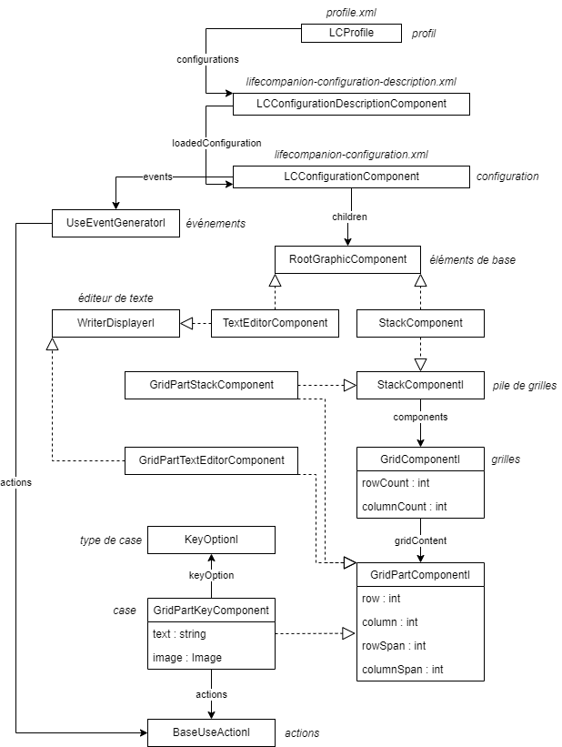

# WIP

# Extends LifeCompanion with plugins

## Introduction

**Plugins are a good way to extends LifeCompanion features without having to modify its core**. It allows developpers to create individual plugin that can be updated out of the app update process. Before creating a plugin, you should be trained to use LifeCompanion (in both mode : edit and use).

Terms used in this documentation will be directly linked to LifeCompanion usages.

Feel free to fill an issue if you're having trouble with plugin development.

## Prerequisites

Read the developpers documentation : [how to build and run LifeCompanion](BUILD.md)

Be familiar with Java and JavaFX development.

## Getting started

### Install plugin dev env. - TODO CLEAN SOURCE FOLDER TO COPY

1. First, clone LifeCompanion official repository and make it build and run locally : [use build documentation](BUILD.md)
1. Run `gradlew publishToMavenLocal` on **lifecompanion-framework** and **lifecompanion** projects (this will add LifeCompanion API to your local Maven repo)
1. TODO FROM HERE
1. Copy the **lifecompanion/lc-example-plugin** to your plugin specific folder
1. Change the folder name
1. Change Gralde project name *settings.gradle*
1. Change the plugin ID in *build.gralde* on key **LifeCompanion-Plugin-Id**
1. To build your plugin : use `gradlew jar`

### Efficient plugin dev. in IntelliJ

1. Create your LifeCompanion project as described in [build documentation](BUILD.md)
1. Add your new plugin project as a module in IntelliJ (File > New > Module from existing sources)
1. Create a run configuration that build your plugin : `gradlew clean jar` (on your plugin project)
1. Create a run configuration that run LifeCompanion app `gradlew :lc-app:run`
1. On the LifeCompanion run configuration
    1. Add on **environment variables** : `org.lifecompanion.dev.cp.arg=../../lifecompanion-plugins/lc-spellgame-plugin/build/libs/*` (this should be adapted to your plugin folder path)
    1. Add : Before launch > Run Another Configuration with your run configuration that build your plugin (`clean jar`)
1. You can now use your LifeCompanion run configuration : this will first build your plugin and inject its last version to LifeCompanion !

### Existing plugins

All the official existing plugins are stored in the **lifecompanion-plugins** folder on the repo (or will be!)

- **simple email plugin** : plugin that allow the user to read and send email from traditionnal email server
- **calendar plugin** : plugin to help user to plan their days (with alarms, events and sequences)
- **ppp plugin** : plugin to trace prediatric pain profil scale for an user
- **homeassistant plugin** : plugin to interact with a HomeAssistant server

## LifeCompanion fundamentals

### Code organization

LifeCompanion code use **Java 16+ and JavaFX** combined with **Gradle**.

Core LifeCompanion code is located in **lifecompanion/lc-app** directory. Model classes are organized with interface/implementation principle : most of the interfaces are named with "I" at the end, theses interfaces are mainly the names used in documentation. For example : `LCConfigurationI` is the interface describing the configuration model, and `LCConfigurationComponent`.

Interfaces are also mostly used as "contracts" to add features to components : for example every component `RootGraphicComponentI` will implement `MovableComponentI, ResizableComponentI, DisplayableComponentI, SelectableComponentI, ConfigurationChildComponentI` interfaces. These coding principle allow LifeCompanion to be simply extended.

You can see the repo organization in [root documentation](README.md)

### General principles

#### Modes

LifeCompanion works with two modes :
- **EDIT** : mode for professionnals or people that want to edit the software behavior. In this mode, the UI is much more complex to be able to edit every elements.
- **USE** : mode for final users to use LifeCompanion : text editors are working, speech synthesis to, etc.

#### Organization



LifeCompanion is working in the following way :
- Any LifeCompanion user creates **profile** (`LCProfile`) that will stores **configurations** (`LCConfigurationDescriptionComponentI` and `LCConfigurationComponent`)
- In **profile**, **configuration** list is displayed thanks to `LCConfigurationDescriptionComponentI` that store configuration information (author, description, id, etc.)
- When a user wants to modify or use a **configuration**, this configuration is loaded with `LCConfigurationComponent` : this component stores all LifeCompanion configuration
- Once a **configuration** is opened : **base elements** (`RootGraphicComponent` implementations) are added to it. Theses components are movable, resizable, etc. to create the user interface. Two main implementation are possible : **grid stacks** (`StackComponent`) and **text editors** (`TextEditorComponent`)
- In **grid stacks**, user will then add **grids** (`GridComponentI`) : these **grids** are the "pages" possible for this stack. Each grid can have its own layout : a number of row/column and sub elements
- In **grids**, regarding to row/column counts, a certain number of **keys** (`GridPartKeyComponent`) are available (eg : 5*4 = 20 keys). Each of these **keys** is located in the grid (thanks to row/column variable) and can span to multiple row/column.
- On **keys**, user will define
    - the **key type** (`KeyOptionI`) : this allow the key to be automatically filled/used by LifeCompanion in use mode (e.g `WordPredictionKeyOption` are filled automatically on runtime)
    - the **key actions** (`BaseUseActionI`) : this define what will be the key behavior on selection. Actions are organized by events (**activation** or **over**) and in ordered list : on action fired (by selection or by key "hover"), action are then executed in order (sequentially)
- In configuration, **events** (`UseEventGeneratorI`) can also be added
    - they are global "listeners" to configuration events : each listener implements an event detection, and then call **actions** list if fired
    - example implementation : event generator "keyboard key pressed" is fired on each key pressed on the keyboard : it can be useful to create keyboard shortcut for example
- In **grids**, keys can be replaced by other implementation (implementing `GridPartComponentI`) : for example, it's possible to replace a key with **sub grid**, **text editor** or **grid stack**. The only difference between their "root" implementation is just that they are not resizable/movable as they location depends on key position/span.

### What's possible with plugins ?

Plugin are a good way to integrate specific features into LifeCompanion. This table presents the main integrated features.

- [**Use action**](#use-action) *("actions")*
    - They are the LifeCompanion's core : added to keys (or to global event) they will define the user interaction behavior. They link keys to global behavior.
- [**Key option**](#key-option) *("type de cases")*
    - Key options are a good way to integrate keys that are modified on runtime by user : their text, image, action are handled by your implementation or you need a specific view for a key (custom JavaFX component).
    - Combined with specific use actions, they are the best way to create custom applications
- [**Use event**](#use-event) *("événement")*
    - Use events are a way to associate global events happening in use mode to specific use actions. Events can also generate use variables that can be then used by use actions.
    - Use events can be used to create generic behavior on global events, to "react" on something happening.
- [**General configuration view**](#general-configuration-view) *("paramètres généraux")*
    - General configuration view will be directly added to the configuration view and allows you to create custom configuration views to do anything
- [**Use variable**](#use-variable) *("variable")*
    - Use variable have two main usage : in `VariableInformationKeyOption` they are "injected" to key text every 1 second in use mode to create keys with variable information. Anywhere in use mode, they can be used : the common usage is to generate variable text in `WriteTextAction` or `SpeakTextAction`
- [**Word prediction**](#word-prediction) *("prédiction de mots")*
    - Word prediction are called on each editor text change (content or caret position). They should return prediction results (ordoned word list)
- [**Char prediction**](#char-prediction) *("prédiction de caractères")*
    - As the word prediction do, the char prediction should do the exact same thing but for characters : results are then used to fill a dynamic keyboard
- [**Voice synthesizer**](#voice-synthesizer) *("synthèse vocale")*
    - Voice synthesizer converts text to speech. Common parameters are shared with all implementation : volume, rate and pitch. Implementation can be system dependant.

## How to

### Plugin

Plugin are loaded by LifeCompanion on startup and their implementation can be used all accross the components.

#### Organization and technical notes

A plugin is composed of a single jar file that is **loaded on classpath**. LifeCompanion plugins don't make any use of Java modules (jigsaw) while LifeCompanion app do. This is made to make it easier to create plugin with their own dependencies.

Plugin projects are built using Gradle like LifeCompanion core. The generated jar file for a plugin contains the plugin general metadata (id, author, version, name, etc) in the jar manifest file. These metadata are used for LifeCompanion to prepare a plugin loading (on next start) and to ensure compatibility and updates.

As plugin are based on LifeCompanion, they are depending of LifeCompanion version. If LifeCompanion is updated with breaking changes, the plugins should be updated. To see the API changes, check [dev changelog documentation](DEV-CHANGELOG.md)

#### Information

#### Properties

Plugin can have properties associated to configuration. These properties are directly saved on configuration if it is detected that the configuration use the plugin (an action, an event, etc).

To implement properties, class has to extends `AbstractPluginConfigProperties` and the plugin implementation should return the property implementation via (see also [Serialization part](#serialization) to understand how properties are stored)

```java
@Override
public PluginConfigPropertiesI newPluginConfigProperties(ObjectProperty<LCConfigurationI> parentConfiguration) {
    return new SpellGamePluginProperties(parentConfiguration);
}
```

If you need to use plugin properties, you can request them on a configuration with

```java
SpellGamePluginProperties pluginConfigProperties = configuration.getPluginConfigProperties(SpellGamePlugin.ID, SpellGamePluginProperties.class);
```

#### Lifecycle

TODO : LC start/stop - mode start/stop

### Use action

Actions are the best way to implement specific behavior in LifeCompanion. Most of the action implementation interact with LifeCompanion [existing controllers](#controllers) or with custom controllers. For example, an email plugin will interact with its own controller to manage inbox, sent messages, etc.

Actions can have parameters that are configured by user in edit mode (optional). If the action have parameters, they will be serialized with the action (check [Serialization part](#serialization)).

Actions will be attached to two components in LifeCompanion (each of these component extending `UseActionTriggerComponentI`)
- **keys** : actions are attached to keys and are generated by the current selection mode, they can be generating by "selecting" the key or by "hovering" it - `GridPartKeyComponentI`
- **events** : action are triggered by general events that can be external to selection mode (e.g. : hour of the day, global key press, etc.) - `UseEventGeneratorI`

When you're implementing an action, you can chose that the action be can added to both of these components or to one of them only. Generally, allowing adding an action to both component is good but sometimes it is not possible : for example the action `WriteLabelAction` can be added to keys only as it will inspect the attached key to write its label (and events don't have labels).

#### Categories

Actions are categorized with main categories (`UseActionMainCategoryI`) and sub categories (`UseActionSubCategoryI`) : each main categories can contains multiple sub categories. The categories are only useful to display the extension in the edit mode UI. It is a good practice to define its own categories for a plugin but a plugin action can be attached to an existing category using `DefaultUseActionSubCategories` enum.

#### Types

Action can be implemented with two ways :
- **Simple use action** : this the most used action type in LifeCompanion. It totally deleguate "when" the action should be executed to LifeCompanion selection system. It the most common way as it's simple : the action can be implemented handling a single "execute" method.
- **Adavanced use action** : this is much less used be can be useful when you need to handle the "start" and the "end" of an action depending on its selection. For example, it's use to create an action deleting char while the key is pressed.

Generally, you should alway implement your action extending `SimpleUseActionImpl`. If you need to create an advanced action, you can directly extend `BaseUseActionImpl` or check `RepeatActionBaseImpl` that already implement a "repeat" action behavior.

#### Edit mode information

Actions have multiple information that are used only in edit mode to drive the user adding/editing them.
These informations should be filled in the action constructor extending `BaseUseActionImpl` (setting the protected attribute to the requested values).

Please refer to each attribute Javadoc to find the expected value in each attribute. (**TODO : CREATE THE JAVADOC**)

Note that `variableDescriptionProperty` can be used in two ways :
- static way : just set the value to the static version of the description : `this.variableDescriptionProperty().set(this.getStaticDescription());`
- dynamic way : if your action have parameters (eg te text to write like `WriteTextAction` action), you can bind the variable description to change when the action parameters change : see [Translations](#translations) and `TranslationFX` part.

#### Execution

Action are executed on a specific Thread (not on the FX Thread) so you should be aware that you can't modify the UI directly : see [Threading part about it](#threading).

**Actions added to a key or to an event are executed sequentially** : the first action should ends before executing the second. This means that if your action is blocking the execution thread, the next action could be never executed. However, LifeCompanion allow 4 components to run action in parallel. If possible, it's better that your action don't create any new thread, however if needed, be aware that use mode could end "outside" your new thread : if you need to interact with general controllers after a while, it's better to check if you're still in use mode (with `AppModeController.isUseMode()`)

### Key option

TODO

### Use event

TODO

### General configuration view

General configuration view are configuration not directly linked to a selected component that allow the configuration of global parameter for the current edited configuration. Generally, the general configuration view is used to modify [plugin properties](#properties)

#### Implementing view

To implement a plugin configuration view, you have to implement `GeneralConfigurationStepViewI`. This will help you creating a configuration view for your plugin : see each method javadoc to understand how each element should be implemented.

#### Handling view lifecycle

#### Handling view cancel/save

For the save/cancel button to be working, you should take care of never modifying directly your configuration. You then have two choices :
- You can move every changes from view to model in `saveChanges()` method : the instance is then modified only when save button is clicked
- You can duplicate your model and then bind the view to it : this can be easier but requires your model to be easely duplicated. In `saveChanges()`you then just have to replace your old model with the new version. If you need this version, you can check how to implement `DuplicableComponentI` interface in examples.

### Use variable

Use variable can be used in multiple LifeCompanion components :
- **Keys** associated with "Information variable" key option : the text content of the key will be changed on runtime (combination of text and variables). It allow for example to display the current time in a key or an user score.
- **Actions** : any action using text can use variables to combine a input text with a variable input. For this, the action configuration view can use `UseVariableTextArea` field to make the variable insertion easier in UI and `UseVariableController.INSTANCE.createText(...)` to create the text with current variables
- **Events** : event can generate their own variable that will be added to the global variable context. This allow an event to generate a variable that will be then used by the associated actions. For example, the event `KeyTypedKeyboardEventGenerator` generates a variable containing the pressed key. If an action is associated to it, it can for example speak the pressed key (with `SpeakTextAction`)

Variable can also be used also to communicate between actions : for example the `FlagUseVariable` can be used to cancel an action following in the execution list if needed : by simply adding the variable to execution context on a first action, and then checking for it in a second action.

#### Defining a global variable

To define a global variable, your plugin should implement :

```java
@Override
public List<UseVariableDefinitionI> getDefinedVariables() {
    return Arrays.asList(//
            new UseVariableDefinition(
                    SpellGameController.VAR_ID_USER_SCORE,
                    "spellgame.use.variable.user.score.name",
                    "spellgame.plugin.use.variable.user.score.description",
                    "spellgame.plugin.use.variable.user.score.example"
            )
    );
}
```
This is just the definition of use variable making it available in the user UI to add a variable to various elements (text, use info keys, etc.)

#### Update variable value

When use mode is running, the plugin method `generateVariables` will be called every second to get the variable new values. If your variable computing is expensive, you may have to cache its value internaly. Your method should create a new Map containing the generated variables with their definition and their value.

```java
@Override
public Map<String, UseVariableI<?>> generateVariables(Map<String, UseVariableDefinitionI> variablesToGenerate) {
    Map<String, UseVariableI<?>> vars = new HashMap<>();
    vars.put(SpellGameController.VAR_ID_USER_SCORE,
            new StringUseVariable(
                    variablesToGenerate.get(SpellGameController.VAR_ID_USER_SCORE),
                    String.valueOf(SpellGameController.INSTANCE.getUserScore())
            ));
    return vars;
}
```

Sometimes it can be usefull to update a variable earlier than the next automatic call to `generateVariables` : for example you want the user score to be updated immediatly after the correct action (instead of waiting ~1 second). For this, you can call `UseVariableController.INSTANCE.requestVariablesUpdate()` and the update will be done as soon as possible (with a supplementary call to `generatedVariables`)

### Word prediction

TODO

### Char prediction

TODO

## General topics

### Controllers

- GlobalKeyEventController :
- AppModeController :

### Utils and helpers

### Threading

Note that action and event are mostly generated out of the JavaFX Thread. This means that if you have to modify UI components, you should explicitly do it on the FXThread (you can use `FXThreadUtils.runOnFXThread()` to do so)

### Translations

#### Files

Even if LifeCompanion is currently available only in french, plugin can have multiple translation files. This is useful to separate code from string data. The plugin will return the path (jar path) to the language files via :

```java
@Override
public String[] getLanguageFiles(final String languageCode) {
    return new String[]{"/text/" + languageCode + "_example_plugin.xml"};
}
```
The injected `languageCode` parameter is the ISO 639-1 code for language ("fr" for french).

Each language file is a basic XML containing key/value for translation. It is recommanded to prefix all your keys with your plugin context, this will avoid collision with other translations.

```xml
<texts>
	<text key="example.plugin.demo.text">J'adore intégrer des {}\nbasiques</text>
</texts>
```

The value for each translation can use `{}` to inject variable on runtime in Translation. It can also use `\n` or `\t` to insert newlines or tabs. Note that newlines or tabs injected without this specific way are not kept in resulting translation.

#### Code API

Translation will then be used later in the code like this :

```java
// Use as static value
Object firstParamObj = 42; // will be converted to String with "toString()"
String resultingTranslationString = Translation.getText("example.plugin.demo.text", firstParamObj);
// Use as JavaFX property value (changing with injected parameters)
IntegerProperty firstParamInt = new SimpleIntegerProperty(42);
StringBinding resultingTranslationProperty = TranslationFX.getTextBinding("example.plugin.demo.text", firstParamInt);
firstParamInt.set(0);
// resultingTranslationProperty has changed
```

Injected parameters can mix :
- JavaFX properties, any `ObservableValue` where the resulting value is got from `ObservableValue.getValue()`
- Raw values (primitive or object) where the resulting value is got from `Object.toString()`

It's recommanded to use `TranslationFX` only when you need changing translation as this relies on binding and change listener consuming more performance than simple translation generated once by `Translation`.

### Serialization

**TODO, think about**

- Serialization use class name, warning if changed
- To serialize attribute, implementation of methods is mandatory
- Backward compatibility should be handled manually
- Empty param public constructor

### App icons

A good pratice to integrate icons in LifeCompanion is to save SVG of your icons and to only integrate the good sized icons into your app resources. Recommanded size are always based on the max. width/height : if your icon ratio is 3/4, for a 32x32 size your icon should be 24*32.

Original LifeCompanion SVG icons can be found in **res/icons**

Here are the LifeCompanion expected icons size :

| TYPE												| SIZE (PX)			|
|---------------------------------------------------|-------------------|
|**use actions / use event generator**				|32x32				|
|**add component icon (in create tab)**				|32x32				|
