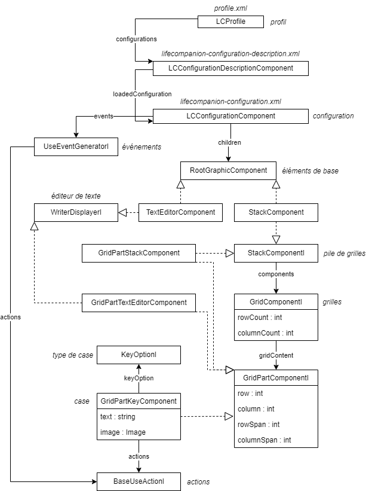

# WIP

# Extends LifeCompanion with plugins

## Introduction

**Plugins are a good way to extends LifeCompanion features without having to modify its core**. It allows developpers to create individual plugin that can be updated out of the app update process. Before creating a plugin, you should be trained to use LifeCompanion (in both mode : edit and use).

Terms used in this documentation will be directly linked to LifeCompanion usages.

Feel free to fill an issue if you're having trouble with plugin development.

## Prerequisites

Read the developpers documentation : [how to build and run LifeCompanion](TODO)

Be familiar with Java and JavaFX development.

## Getting started

TODO : how to install plugin dev tools
TODO : how to run a plugin (cf  `org.lifecompanion.dev.cp.arg=../lc-example-plugin/build/libs/*`)

## LifeCompanion fundamentals

### Code organization

LifeCompanion code use **Java 16+ and JavaFX** combined with **Gradle**.

Core LifeCompanion code is located in **lifecompanion/lc-app** directory. Model classes are organized with interface/implementation principle : most of the interfaces are named with "I" at the end, theses interfaces are mainly the names used in documentation. For example : `LCConfigurationI` is the interface describing the configuration model, and `LCConfigurationComponent`.

Interfaces are also mostly used as "contracts" to add features to components : for example every component `RootGraphicComponentI` will implement `MovableComponentI, ResizableComponentI, DisplayableComponentI, SelectableComponentI, ConfigurationChildComponentI` interfaces. These coding principle allow LifeCompanion to be simply extended.

**TODO : link to repo organization**

### General principles

LifeCompanion works with two modes :
- **EDIT** : mode for professionnals or people that want to edit the software behavior. In this mode, the UI is much more complex to be able to edit every elements.
- **USE** : mode for final users to use LifeCompanion : text editors are working, speech synthesis to, etc.

LifeCompanion is working in the following way :
- Any LifeCompanion user creates **profile** (`LCProfile`) that will stores **configurations** (`LCConfigurationDescriptionComponentI` and `LCConfigurationComponent`)
- In **profile**, **configuration** list is displayed thanks to `LCConfigurationDescriptionComponentI` that store configuration information (author, description, id, etc.)
- When a user wants to modify or use a **configuration**, this configuration is loaded with `LCConfigurationComponent` : this component stores all LifeCompanion configuration
- Once a **configuration** is opened : **base elements** (`RootGraphicComponent` implementations) are added to it. Theses components are movable, resizable, etc. to create the user interface. Two main implementation are possible : **grid stacks** (`StackComponent`) and **text editors** (`TextEditorComponent`)
- In **grid stacks**, user will then add **grids** (`GridComponentI`) : these **grids** are the "pages" possible for this stack. Each grid can have its own layout : a number of row/column and sub elements
- In **grids**, regarding to row/column counts, a certain number of **keys** (`GridPartKeyComponent`) are available (eg : 5*4 = 20 keys). Each of these **keys** is located in the grid (thanks to row/column variable) and can span to multiple row/column.
- On **keys**, user will define
    - the **key type** (`KeyOptionI`) : this allow the key to be automatically filled/used by LifeCompanion in use mode (e.g `WordPredictionKeyOption` are filled automatically on runtime)
    - the **key actions** (`BaseUseActionI`) : this define what will be the key behavior on selection. Actions are organized by events (**activation** or **over**) and in ordered list : on action fired (by selection or by key "hover"), action are then executed in order (sequentially)
- In configuration, **events** (`UseEventGeneratorI`) can also be added
    - they are global "listeners" to configuration events : each listener implements an event detection, and then call **actions** list if fired
    - example implementation : event generator "keyboard key pressed" is fired on each key pressed on the keyboard : it can be useful to create keyboard shortcut for example
- In **grids**, keys can be replaced by other implementation (implementing `GridPartComponentI`) : for example, it's possible to replace a key with **sub grid**, **text editor** or **grid stack**. The only difference between their "root" implementation is just that they are not resizable/movable as they location depends on key position/span.

### What's possible with plugins ?

Plugin are a good way to integrate specific features into LifeCompanion. This table presents the main integrated features.

- [**Use action**](#use-action) *("actions")*
    - They are the LifeCompanion's core : added to keys (or to global event) they will define the user interaction behavior. They link keys to global behavior.
- [**Key option**](#key-option) *("type de cases")*
    - Key options are a good way to integrate keys that are modified on runtime by user : their text, image, action are handled by your implementation or you need a specific view for a key (custom JavaFX component).
    - Combined with specific use actions, they are the best way to create custom applications
- [**Use event**](#use-event) *("événement")*
    - Use events are a way to associate global events happening in use mode to specific use actions. Events can also generate use variables that can be then used by use actions.
    - Use events can be used to create generic behavior on global events, to "react" on something happening.
- [**General configuration view**](#general-configuration-view) *("paramètres généraux")*
    - General configuration view will be directly added to the configuration view and allows you to create custom configuration views to do anything
- [**Use variable**](#use-variable) *("variable")*
    - Use variable have two main usage : in `VariableInformationKeyOption` they are "injected" to key text every 1 second in use mode to create keys with variable information. Anywhere in use mode, they can be used : the common usage is to generate variable text in `WriteTextAction` or `SpeakTextAction`
- [**Word prediction**](#word-prediction) *("prédiction de mots")*
    - Word prediction are called on each editor text change (content or caret position). They should return prediction results (ordoned word list)
- [**Char prediction**](#char-prediction) *("prédiction de caractères")*
    - As the word prediction do, the char prediction should do the exact same thing but for characters : results are then used to fill a dynamic keyboard
- [**Voice synthesizer**](#voice-synthesizer) *("synthèse vocale")*
    - Voice synthesizer converts text to speech. Common parameters are shared with all implementation : volume, rate and pitch. Implementation can be system dependant.

## How to

### Plugin

### Use action

Action are the best way to implement specific behavior in LifeCompanion. Most of the action implementation interact with LifeCompanion [existing controllers](#controllers) or with custom controllers. For example, an email plugin will interact with its own controller to manage inbox, sent messages, etc.

### Key option

TODO

### Use event

TODO

### General configuration view

TODO

### Use variable

TODO

### Word prediction

TODO

### Char prediction

TODO

## General topics

### Controllers

- GlobalKeyEventController :
-

### Utils and helpers

### Translations

### Serialization

### App icons

A good pratice to integrate icons in LifeCompanion is to save SVG of your icons and to only integrate the good sized icons into your app resources. Recommanded size are always based on the max. width/height : if your icon ratio is 3/4, for a 32x32 size your icon should be 24*32.

Original LifeCompanion SVG icons can be found in **res/icons**

Here are the LifeCompanion expected icons size :

| TYPE												| SIZE (PX)			|
|---------------------------------------------------|-------------------|
|**use actions / use event generator**				|32x32				|
|**add component icon (in create tab)**				|32x32				|
