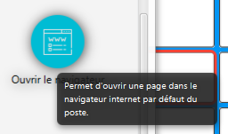
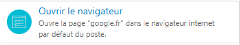

# LifeCompanion plugin API

## General principles

Plugins in LifeCompanion allow extending base software features to add or modify existing behavior.

Plugin allow the add of :

- Word predictions
- Char predictions

- **TODO CONTINUE THE LIST**

Plugin should be implemented using Java 11 without modules. Plugin should then be package as JAR file.
LifeCompanion will add the plugin JAR file to classpath on startup and will then load it.
Plugin information should be described in the MANIFEST file of the JAR file. JAR file can also include resources or external dependencies as they will be also loaded on the classpath.
Every implementations created for your plugin should contains default empty arg constructor : LifeCompanion plugin loading use Reflection to instanciate the different types.
If you need to initialize plugin information, refer to each implementation *init/start/etc...* methods instead of doing it in the constructor.
Plugin version should respect semantic versioning format (-SNAPSHOT etc authorized)

- TODO : link plugin and app version
- TODO : add icons size required
- TODO : add plugin Manifest info list

# PREVIOUS OLD PLUGIN DOCUMENTATION


# Termes récurrents

* **Mode configuration** : le mode de LifeCompanion qui affiche l'interface pour configurer le logiciel. Utilisée généralement par les thérapeutes.
* **Mode utilisation** : le mode de LifeCompanion quand on "lance" une configuration définie, dans lequel la sélection des cases peut se faire directement, par sélection, etc... Utilisé par des personnes n'ayant pas toujours l'accés complet à un ordinateur, il faut donc penser nos interfaces en fonction.

# Concepts généraux

* [Sauvegarde et lecture d'informations dans LifeCompanion](Serialisation)
* [Textes et traduction](Textes)
* [Migration d'une extension en version >= 0.7.0-SNAPSHOT](Migration)

# Vue d'ensemble

## Structure d'une extension

Une extension LifeCompanion permet de modifier les éléments de LifeCompanion, en ajoutant ou modifiant des comportements par défaut. Une extension est un fichier **.jar** qui peut comporter un ou plusieurs plugins. Le fichier jar peut également contenir des ressources (images, sons, etc...).

Le fichier jar de l'extension doit se trouver dans **[Racine de LifeCompanion]/data/lifecompanion-data/plugins/plugins-jar**. C'est ce chemin qu'il faut placer dans le pom.xml pour que le jar de l'extension soit généré au bon endroit. Par défaut, la racine de LifeCompanion se trouve dans le répertoire de l'utilisateur courant.

## Possibilités offertes par une extension

Une extension peut modifier les éléments suivants dans LifeCompanion.
Il est conseillé de bien comprendre le fonctionnement de ces éléments dans LifeCompanion avant de commencer leur développement.

* Actions
* Variables : globales ou générées par les événements (utilisables dans certains actions, ou dans les cases d'informations variables)
* Événements
* Types de case
* Ajout d'éléments : éléments à ajouter (pour pouvoir les ajouter par glisser - déposer depuis le panneau situé sur la gauche)
* Configuration de l'extension
* Prédiction de mots
* Prédiction de caractères
* Synthèse vocale

## Astuces de développement

L'API de plugin est fournie avec une partie des sources de LifeCompanion ainsi que plusieurs extensions d'exemples. Afin de gagner du temps, il est conseillé d'explorer ces exemples et les implémentations dans LifeCompanion. Par exemple, afin d'écrire une action, il faut explorer les sous classes de **BaseUseActionI**.
La Javadoc de l'API est également assez complète, il faut donc prendre le temps de lire la documentation de chaque méthode. 

Raccourcis claviers Eclipse utiles :

* **Ctrl + Maj + T** pour ouvrir une classe, et ensuite **Ctrl + T** en sélectionnant le nom de celle-ci pour voir les sous classes
* **Ctrl + Alt + H** pour trouver tous les appels d'une méthode ou d'un attribut, très utile pour savoir comment les éléments sont utilisés

# Développement

## Déploiement

Dans LifeCompanion, les extensions sont distribuées sous forme de fichier **.jar**. Ces fichiers sont situés dans le dossier **data/lifecompanion-data/plugins/plugins-jar** au sein du dossier LifeCompanion.
Le fichier d'extension (fichier .jar) est produit à l'aide de Maven : le plugin **maven-shade-plugin** permet de créer un fichier contenant le code du plugin, ainsi que toutes les librairies utilisées par celui-ci. Ces librairies doivent bien évidement être importées grâce à Maven.

Un même fichier peut contenir plusieurs plugin : il suffit pour cela d'implémenter plusieurs fois l'interface **PluginI** dans un même projet Maven. Il est cependant conseillé de faire un projet par plugin.

Les plugins sont chargés au démarrage de LifeCompanion, ou à l'ajout dans celui-ci. Il est donc conseillé en développement de redémarrer LifeCompanion à chaque fois que vous effectué un build de votre plugin. La propriété Maven **lifecompanion.plugin.directory** est utile pour placer votre plugin directement dans le dossier de LifeCompanion, sans devoir le copier ou l'ajouter manuellement à chaque build.

Lorsque vous testez votre plugin en développement, vous pouvez avoir envie de logger des informations, ou des erreurs peuvent se produirent. Les logs de LifeCompanion sont situés dans le dossier **data/lifecompanion-data/logs/**.

## Extensions

### Informations

Pour développer une extension, il suffit d'implémenter la classe **PluginI**.
La classe possède de nombreuses méthodes différentes, certaines n'ont qu'une valeur informative, et d'autres servent à définir le comportement de l'extension.

Une première étape consiste à implémenter les méthodes suivantes :

```
#!java
public String getId();
public String getName();
public String getAuthor();
public String getVersionLabel();
public String getDescription();
public long getVersion();
public String[] getLanguageFiles(String languageCode);
```
Chaque méthode possède une Javadoc qui décrit son rôle. Elles servent principalement à retourner les informations de l'extension. Ces informations seront affichées dans l'onglet extension de LifeCompanion.


### Informations techniques

Les méthodes 
```
#!java
public long getVersion();
public String getId();
```
servent à retourner les informations de l'extension qui serviront à l'identifier. L'ID de l'extension doit être unique et ne jamais changer (vérifiez donc qu'aucune autre extension n'ait le même nom). La version est un nombre qui augmente si des modifications de l'extension ne sont pas compatibles avec les nouvelles versions. Le développeur d'extension est responsable de son ID, et du moment auquel la version d'une extension doit être incrémentée.

Ces informations sont enregistrées avec une configuration qui utilise l'extension afin d'obliger l'utilisateur à posséder l'extension pour ouvrir une configuration.

### Traduction

Dans LifeCompanion, les textes ne doivent pas être retournés "bruts" dans le but d'être traduits par la suite.

La méthode 
```
#!java
public String[] getLanguageFiles(String languageCode);
```
sert à retourner les chemins des fichiers de langue, le paramètre donné est un code ISO 639-1 en minuscule ("fr" pour Français). Il faut donc retourner le bon fichier en fonction de la langue voulue. Pour l'instant, la seule langue supportée par LifeCompanion est le français mais cela peut changer. Les fichiers de langues doivent se trouver dans le dossier **src/main/resources** de l'extension (Maven placera automatiquement les fichiers dans le JAR généré).
Vous pouvez générer le chemin vers le fichier en fonction du code de langue, ou toujours retourner le même fichier si votre plugin de supporte pas la traduction.

Pour plus de détails sur le fonctionnement de la traduction, vous pouvez aller sur la page [Textes et traduction](Textes).

### Cycle de vie

Les méthodes 
```
#!java
public void start(PluginContextI context, File dataFolder);
public void stop(PluginContextI context, File dataFolder);
```
sont appelées lorsque l'extension est initialisée dans LifeCompanion (c'est à dire lorsque LifeCompanion démarre, ou lorsque l'extension est ajoutée par l'utilisateur). Le contexte doit être conservé par l'extension pour accéder aux fonctions de LifeCompanion. Le dossier passé en paramètre peut être utilisé par l'extension pour stocker des informations, ou y sauvegarder des ressources. La méthode **stop** est appelée lorsque l'extension est supprimée de LifeCompanion ou que l'application se ferme, elle doit fermer toutes les éventuelles ressources utilisées par l'extension.

Les méthodes 
```
#!java
public void modeStart(LCConfigurationI configuration);
public void modeStop(LCConfigurationI configuration);
```
sont appelées quand la configuration passe en mode utilisation. Elles sont appelées avec l'instance de la configuration qui sera utilisée. Elles peuvent servir à modifier la configuration ou encore à effectuer des initialisations spécifiques au mode utilisation. Une fois que l'utilisateur repasse en mode édition, ou qu'il ferme LifeCompanion, la méthode **modeStop** est appelée avec la même instance de configuration. Sachant que la configuration affichée en mode édition n'est pas la même que celle affichée en mode utilisation, il n'y a pas besoin d'annuler ses modifications sur la configuration.

### Sérialisation

Un plugin peut sauvegarder et charger des informations en XML au sein d'une configuration si cela est nécessaire. C'est très utile pour stocker les paramètres du plugin au sein d'une configuration (par exemple des infos de connexion, etc...). Pour cela, il suffit au plugin d'implémenter les méthodes suivantes :
```
#!java
public Element serialize(IOContextI context);
public void deserialize(Element node, IOContextI context) throws LCException;
```
Les méthodes seront appelées à la sauvegarde et au chargement d'une configuration de LifeCompanion. Notez qu'afin de créer une nouvelle configuration avec les informations sauvegardées par défaut, le plugin doit également implémenter la méthode suivante :
```
#!java
public void reinit();
```
Et faire en sorte qu'elle réinitialise toutes les valeurs par défaut des informations sauvegardées. La méthode sera appelée à la création d'une nouvelle configuration, ou juste avant le chargement d'une configuration (avant l'appel à deserialize).

Pour plus de détails sur la sauvegarde/lecture des informations, vous pouvez aller sur la [page dédiée](Serialisation).

## Actions

### Description générale

Les actions sont un des éléments principaux de LifeCompanion : elles sont ajoutées sur un case ou sur un événement. Chaque case ou événement peut avoir une liste d'actions à exécuter, les actions d'une liste sont exécutées les unes après les autres.
Dans LifeCompanion, les actions peuvent être déclenchées de trois manières différentes :

* Activation d'une case : lorsque l'utilisateur sélectionne une case (en sélection directe avec un clic, en défilement, etc...)
* Survol d'une case : lorsque l'utilisateur passe sa souris au dessus d'une case, ou que le défilement défile au dessus de la case
* Déclenchement d'un événement : lorsqu'un événement est lancé dans LifeCompanion, et que l'action y est associée.

### Type d'action

Les actions implémentent toutes l'interface **BaseUseActionI**, mais la plupart implémente également **SimpleUseActionI**.
La différence entre ces deux interfaces est simple :

*  **BaseUseActionI** : permet de créer une action dont on a totalement le contrôle des événements, on sait quand l'événement commence et quand il se termine. Par exemple lors d'un clic, une méthode est appelée lorsque le bouton est enfoncé, et une autre est appelée lorsqu'il est relâché. Ce genre d'action ignore donc certains paramètres du mode de sélection.
* **SimpleUseActionI** : permet de faire une action simple, lorsque l'action doit être déclenchée (déterminé par rapport au mode de sélection). L'action ne se préoccupe pas de savoir quand l'événement commence ou quand il se termine.

Un exemple d'utilisation de ces deux types d'action : 

* l'action **DeleteLastCharAndRepeatAction** (supprimer le dernier caractère) est simplement implémentée avec une **BaseUseActionI**. Cela permet au début de l'événement de commencer à supprimer le dernier caractère, puis de continuer à supprimer si la pression est maintenue (l'utilisateur reste appuyé sur la case). Dans ce cadre, l'action doit avoir le total contrôle du début et de la fin de l'événement.
* l'action **SpeakTextAction** (permet de prononcer un texte avec la synthèse vocale) est implémentée avec **SimpleUseActionI**. Son comportement est simple, quand elle s'active, le texte paramétré doit être prononcé par la synthèse, pas besoin dans ce cas de savoir quand l'utilisateur a commencé à appuyer, ou quand il a fini.

Il faut avoir conscience qu'**il y a une instance de votre action** par case/événement à laquelle celle-ci est associée. Le constructeur de votre action sera donc appelé de nombreuses fois, il doit être sans paramètres.
Une même instance peut voir sa méthode "execute(...)" appelée plusieurs fois si une même case est activée plusieurs fois dans la même session d'utilisation.

### Implémentation d'une action

Dans cette exemple, nous allons implémenter une action qui permet d'ouvrir le navigateur internet de l'ordinateur sur une page internet définie.

Afin de permettre une implémentation rapide et efficace d'une action, il suffit de créer une classe qui hérite de la classe **SimpleUseActionImpl**. Nous l'appelerons **OpenBrowserAction**.
```
#!java
public class OpenBrowserAction extends SimpleUseActionImpl<UseActionTriggerComponentI> {
```
Le type générique sur l'action détermine l'élément auquel l'action peut être associé (événement ou case). Le type **UseActionTriggerComponentI** signifie qu'elle peut être associée aux deux sans problèmes. Dans certains cas, on veut restreindre l'association à un certain type, par exemple une action "Écrire le label de la case" sera évidement associée uniquement à une case (sinon on ne sait pas quel label écrire). Dans ce cas, on met **GridPartKeyComponentI** à la place de **UseActionTriggerComponentI** (il suffit de regarder les sous classes de UseActionTriggerComponentI pour savoir comment restreindre sur un élément en particulier).

Le constructeur de l'action doit renseigner les informations de l'action (son nom, sa description, etc...). Ces informations sont utilisées dans l'IHM pour afficher l'action.
```
#!java
public OpenBrowserAction() {
	super(UseActionTriggerComponentI.class);
	this.nameID = "useaction.openbrowser.action.name";
	this.staticDescriptionID = "useaction.openbrowser.action.description";
	this.category = DefaultUseActionSubCategories.MOVE_TO_COMPLEX;
	this.order = 15;
	this.parameterizableAction = true;
	this.urlToOpen = new SimpleStringProperty();
	this.variableDescriptionProperty().bind(FUSText.getTextBinding("useaction.openbrowser.action.description.variable", this.urlToOpen));
}
```
Le nom et la description de l'action doivent utiliser des clés de traduction (cf la partie "traduction"). La catégorie de l'action sert à l'afficher dans l'IHM. Le plugin peut définir ses propres catégories, ou utiliser les existantes grâce à l'énumération **DefaultUseActionSubCategories**. L'ordre permet de placer l'action dans cette sous catégorie : on peut mettre 0 pour la voir en premier, ou un très grand nombre pour la voir à la fin.
Le nom et la description statique servent lorsqu'on affiche une action dans le sélecteur d'action.



L'attribut **parameterizableAction** permet de signifier que cette action sera paramétrable : dans notre cas on veut définir l'URL à ouvrir. Certaines action peuvent n'avoir aucun paramètre, par exemple sur l'action **SpeakLabelAction**, on ne définit aucun paramètre particulier. Le fait de mettre ce paramètre à "true" implique qu'il faudra créer une vue de configuration pour cette action.

L'attribut **urlToOpen** est spécifique à notre action : il permet de stocker l'URL à ouvrir.

Enfin, l'attribut **this.variableDescriptionProperty()** est bindé sur un texte en fonction de l'URL à ouvrir. Cela permet, une fois l'action ajoutée, d'afficher ce qu'elle fera vraiment, plutôt qu'une description générique. Par exemple afficher "Ouvre le navigateur sur la page google.fr" (cf la partie "traduction" pour mieux comprendre le binding). Elle sera utilisé une fois l'action ajoutée.



La méthode qui correspond au comportement de l'action est la suivante :
```
#!java
@Override
public void execute(UseActionEvent event, Map<String, UseVariableI<?>> variables) {
}
```
C'est dans cette méthode que le comportement de l'action doit être implémentée. Plusieurs choses importantes sont à retenir à propos de l'implémentation d'une action :

* **Thread** : cette méthode est exécutée dans un autre Thread que le Thread principal. Une action peut donc sans problème exécuter une action longue sans lancer de nouveau Thread. Si elle modifie l'interface, il faut bien penser à le faire sur le Thread de Java FX (cf l'introduction de [Concurrency in JavaFX](http://docs.oracle.com/javafx/2/threads/jfxpub-threads.htm))
* **Séquentielle** : bien qu'elle soit exécutée dans un autre Thread, le fait que la méthode retourne (c'est à dire dès que la méthode termine) implique que l'action suivante sera lancée (si il y a plusieurs actions sur la même case/événement). Et si toutes les actions d'une case sont terminées, le défilement peut reprendre. Cela veut dire que si votre action doit mettre en pause le défilement, elle ne doit pas retourner avant la fin (e.g. pas lancer de nouveaux Thread, etc...)
* **Erreurs** : une action peut lancer une Exception en cas d'erreur, cela ne fera pas crasher LifeCompanion, mais risque de bloquer l’exécution des actions suivantes dans la liste. Dans la plupart des cas, les actions doivent se préoccuper de leurs erreurs afin de ne pas perturber l'exécution. Il faut aussi penser que l'utilisateur n'a pas forcément un accès total à son ordinateur (défilement, pas de clic direct), donc il **ne faut surtout pas afficher de boîtes de dialogue** !

Au moment de l'exécution d'une action, deux paramètres lui sont passés :

* **event** : contient la source qui a conduit à exécuter cette action (survol d'une case, clic sur celle-ci, déclenchement d'un événement)
* **variables** : contient les variables actuelles de LifeCompanion, ainsi que celles générées par l'événement si l'action est attachée à un événement. Cela peut être utile, car dans le cadre d'un événement, l'action peut vouloir utiliser une variable générée par celui-ci. (cf partie "variables"). Peut également contenir des variables ajoutées par les actions précédentes : cela peut servir aux actions à communiquer entre elles.

Lorsque l'action a des paramètres, elle doit penser à les sauvegarder. Il faut pour cela qu'elle implémente les méthodes de lecture/écriture des informations de l'action.
```
#!java
@Override
public Element serialize(IOContextI context) {
	Element xmlElement = super.serialize(context);
	XMLObjectSerializer.serializeInto(OpenBrowserAction.class, this, xmlElement);
	return xmlElement;
}

@Override
public void deserialize(Element node, IOContextI context) throws LCException {
	super.deserialize(node, context);
	XMLObjectSerializer.deserializeInto(OpenBrowserAction.class, this, node);
}
```
Pour plus de détails sur le fonctionnement de ces méthodes, rendez vous sur la [page dédiée](Serialisation).

### Vue de configuration d'une action

Lorsqu'une action possède des paramètres que l'utilisateur (le configurateur) peut modifier en mode configuration, il faut associer à l'action une vue de configuration.
Dans le cas de notre action OpenBrowserAction, nous voulons pouvoir paramétrer l'URL qui sera ouverte, l'attribut **parameterizableAction** a été mis à "true".

Pour cela, on doit implémenter l'interface **UseActionConfigurationViewI**. Nous appelerons notre implémentation **OpenBrowserActionConfigView**.
Notre classe n'a pas de constructeur, et si elle en avait un il devrait être vide.
L'interface prend un type générique qui doit être celui de l'action à paramétrer. A noter qu'on hérite également de **VBox**, qui est une classe de JavaFX. Ce noeud nous servira à afficher la vue de configuration.
```
#!java
public class OpenBrowserActionConfigView extends VBox implements UseActionConfigurationViewI<OpenBrowserAction> {
```
Cette méthode doit retourner le noeud graphique JavaFX qui sera affiché pour configurer l'action. En l'occurence, comme notre classe hérite de VBox, on retourne notre propre classe.
```
#!java
@Override
public Region getConfigurationView() {
	return this;
}
```
Cette méthode retourne la classe de l'action que l'on configure : c'est obligatoire pour que LifeCompanion connaisse la vue à afficher pour une action.
```
#!java
@Override
public Class<OpenBrowserAction> getConfiguredActionType() {
	return OpenBrowserAction.class;
}
```
Cette méthode sert à initialiser l'interface. Elle est automatiquement appelée par LifeCompanion afin de permettre à la vue de s'initialiser. Dans notre cas, on créer notre champs de texte ainsi que son label associé à ce moment.
```
#!java
@Override
public void initUI() {
	fieldUrlToOpen = new TextField();
	fieldUrlToOpen.setPromptText(FUSText.getText("open.browser.ui.example.url"));
	Label labelUrl = new Label(FUSText.getText("open.browser.ui.url.to.open"));
	this.getChildren().addAll(labelUrl, this.fieldUrlToOpen);
}
```
Ces méthodes sont appelées lorsque la vue de configuration s'ouvre (editStarts) et lorsqu'elle se ferme (editEnds). Lorsqu'elle s'ouvre, on doit synchroniser notre vue avec l'action à modifier passée en paramètre. Lorsqu'elle se ferme, on doit mettre à jour notre action passée en paramètre par rapport à ce qui a été entré dans la vue.
```
#!java
@Override
public void editStarts(OpenBrowserAction element, ObservableList<UseVariableDefinitionI> possibleVariables) {
	this.fieldUrlToOpen.setText(element.urlToOpenProperty().get());
}

@Override
public void editEnds(OpenBrowserAction element) {
	element.urlToOpenProperty().set(this.fieldUrlToOpen.getText());
}
```
Une fois ces méthodes implémentées, notre vue de configuration est prête. Dans le cas de notre action d'exemple, la vue de configuration est très simple, mais elle peut contenir autant de noeud/sous noeud que nécessaire.

### Ajout dans le plugin

Maintenant que notre action et sa vue de configuration sont implémentées, il faut informer LifeCompanion que notre plugin défini ces deux éléments.
Pour cela, il faut implémenter les deux méthodes suivantes du plugin :
```
#!java
@Override
public List<Class<? extends BaseUseActionI<?>>> getUseActions() {
	return Arrays.asList(OpenBrowserAction.class);
}

@Override
public List<Class<? extends UseActionConfigurationViewI<?>>> getUseActionConfigurationViews() {
	return Arrays.asList(OpenBrowserActionConfigView.class);
}
```
Ces méthodes doivent retourner les classes des actions implémentées et de leurs vues de configuration. A noter qu'il peut ne pas y avoir de vue de configuration si l'action n'est pas paramétrable.

## Variables

### Description générale

Dans LifeCompanion, on peut avoir des "variables", ces variables sont en fait des chaînes de caractères dont la valeur peut changer au cours de l'utilisation d'une configuration. Les variables sont utiles pour afficher dans la configuration des éléments qui changent au cours du temps : l'heure, la date, l'élément survolé, etc... Elles peuvent également être générées par les événements de LifeCompanion (cf partie événements).

Les variables peuvent être utilisées principalement à deux endroits :

* Dans les cases de type "Informations variables" qui permettent de combiner un texte de case et des variables.
* Dans certaines actions, qui offrent la possibilité d'utiliser les variables


*Variables disponnibles dans les cases de type "Informations variables"*


*Variables disponnibles dans certaines actions*

### Implémentation

Une variable est composée de deux éléments :

* D'une définition : c'est une instance de **UseVariableDefinition** (qui implémente **UseVariableDefinitionI**). Cette définition ne doit pas changer dans le temps pour une même variable. Elle contient son ID, mais également son nom, sa description, et une valeur d'exemple. C'est cette définition qui est utilisée dans l'IHM.
* D'une valeur : c'est une instance de **UseVariableI** (le plus souvent de **StringUseVariable**), cette instance doit être générée à chaque changement de valeur de la variable. C'est cette instance qui est passée dans les Map de variables.

Pour définir une variable globale dans un plugin, il faut implémenter deux méthodes. Imaginons qu'on veuille définir une variable qui indique le temps depuis le démarrage de la configuration en secondes.
Nous allons d'abord retourner la définition de cette variable.
```
#!java
@Override
public List<UseVariableDefinitionI> getDefinedVariables() {
	return Arrays.asList(new UseVariableDefinition(START_TIME_DEF_ID, "start.time.plugin.variable.name", "start.time.plugin.variable.description",
			"start.time.plugin.variable.example"));
}
```
LifeCompanion sait désormais qu'il peut proposer notre variable dans son interface. Il faut maintenant qu'on définisse le contenu de notre variable. Pour cela, LifeCompanion appel automatiquement une méthode de notre plugin toutes les 1000 millisecondes, la méthode doit alors générer la valeur à ce moment précis.
```
#!java
@Override
public Map<String, UseVariableI<?>> generateVariables(Map<String, UseVariableDefinitionI> variablesToGenerate) {
	Map<String, UseVariableI<?>> vars = new HashMap<>();
	UseVariableDefinitionI exampleVarDef = variablesToGenerate.get(START_TIME_DEF_ID);
	vars.put(START_TIME_DEF_ID, new StringUseVariable(exampleVarDef, ((System.currentTimeMillis() - this.startTime) / 1000) + "s"));
	return vars;
}
```
Grâce à cette méthode, on récupère la définition de notre variable à générer (grâce à son ID dans START_TIME_DEF_ID), puis on calcul sa valeur, et on l'ajoute dans une Map qui contient une association entre notre ID de variable et sa valeur.

La génération de variables dans les événements se base sur les mêmes classes, mais employées différement. Rendez vous dans la partie événement pour voir comment faire.

## Événements

### Description générale

Les événements dans LifeCompanion sont des éléments très utiles. Ils permettent à LifeCompanion de recevoir des événements internes ou externes et d'effectuer des actions en fonction de ces événements. Par exemple, un événement peut être généré quand une touche du clavier est appuyée, ou encore, quand un email est reçu par l'utilisateur. A chaque événement peut être associé une liste d'action (cf partie actions). Les actions permettent donc de traiter l'événement lancé.

Les événements dans LifeCompanion sont basés sur les mêmes principes que les actions : ils ont des catégories, un nom, une icône, une description, etc... Ils peuvent également être paramétrés, et leurs paramètres peuvent être sauvegardés sur la configuration. Le fonctionnement des éléments communs avec les actions étant exactement le même, il ne sera pas détaillé dans cette partie.

### Implémentation

Pour implémenter un événement dans LifeCompanion, il suffit d'hériter de la classe **BaseUseEventGeneratorImpl**. Le constructeur fonctionne comme celui des actions, la partie "informations" n'est donc pas détaillée ici.
En revanche, un événement peut également générer des variables, que les actions pourront utiliser. Imaginons un événement "Email reçu", il est bien qu'il génère des variables tel que "ContenuEmail" ou "ExpéditeurEmail".
Nous allons nous baser sur un exemple d'événement très simple : un événement qui est lancé au lancement de la configuration, et qui génère une variable "nom de la configuration". Nous l'appelerons **OnConfigurationStartEventGenerator**.

Pour cet exemple, nous allons définir dans le constructeur la variable que celui-ci génère:
```
#!java
public OnConfigurationStartEventGenerator() {
	// [...] infos identiques à une configuration
	useVariableConfigurationName = new UseVariableDefinition("LaunchConfigurationName", "use.variable.configuration.launch.name",
			"use.variable.configuration.launch.description", "use.variable.configuration.launch.example");
	this.generatedVariables.add(useVariableConfigurationName);
}
```
Grâce à cela, les actions qui seront "branchées" sur cet événement sauront qu'il génère une variable "LaunchConfigurationName" et qu'elles peuvent l'utiliser (cf la méthode *editStarts* de **UseActionConfigurationViewI**).

Contrairement à une action, un événement est responsable de son propre déclenchement : il n'a donc pas de méthode spécifique à implémenter pour son comportement. En revanche, il est important pour un événement de savoir quand la configuration est lancée et quand celle-ci s'arrête. A partir du moment où la configuration est lancé, l'événement peut générer des événements : si par exemple il scrute une valeur pour lancer un événement à chaque changement, il doit commencer à la scruter au démarrage de la configuration, et arrêter lorsque celle-ci s'arrête.

Par exemple, l'implémentation pour **OnConfigurationStartEventGenerator**, l'implémentation est la suivante :
```
#!java
@Override
public void modeStart(LCConfigurationI configuration) {
	started = true;
	LCConfigurationDescriptionI configDesc = ExamplePlugin.CONTEXT.getAppController().currentConfigDescriptionProperty().get();
	Thread generateStartEventThread = new Thread(() -> {
		LCUtils.safeSleep(delay.get());//Delay configured by user
		if (started) {
			useEventListener.fireEvent(this, Arrays.asList(new StringUseVariable(useVariableConfigurationName,
					configDesc != null ? configDesc.configurationNameProperty().get() : "null")), null);
		}
	});
	generateStartEventThread.setDaemon(true);
	generateStartEventThread.start();
}
@Override
public void modeStop(LCConfigurationI configuration) {
	this.started = false;
}
```
La partie clé de cette implémentation se trouve dans le Thread : l'appel à **UseEventListenerI.fireEvent(...)**. C'est cet appel qui informe l'application qu'un événement a été généré. Dans notre implémentation, l'événement a également généré un variable, qui est passée dans une liste.

Notre générateur d'événement étant implémenté, on peut avoir besoin d'une vue de configuration pour celui-ci. Le principe est exactement le même que celui d'une vue de configuration d'une action, la différence est qu'on implémente la classe **UseEventGeneratorConfigurationViewI**, mais les principes sont les mêmes.

### Ajout dans le plugin

Maintenant que notre événement et sa vue de configuration sont implémentés, il faut informer LifeCompanion que notre plugin défini ces deux éléments.
Pour cela, il faut implémenter les deux méthodes suivantes du plugin :
```
#!java
@Override
public List<Class<? extends UseEventGeneratorI>> getUseEventGenerators() {
	return Arrays.asList(OnConfigurationStartEventGenerator.class);
}

@Override
public List<Class<? extends UseEventGeneratorConfigurationViewI<?>>> getUseEventGeneratorConfigurationViews() {
	return Arrays.asList(OnConfigurationStartConfigView.class);
}
```
Ces méthodes doivent retourner les classes des événéments implémentés et de leurs vues de configuration. A noter qu'il peut ne pas y avoir de vue de configuration si l'événement n'est pas paramétrable.

## Types de case

### Description générale

Dans LifeCompanion, il existe un moyen de considérer certaines cases comme "particulières". Cela permet de définir ces cases comme étant spécifiques à une fonction donnée, leur permet de définir leur propre texte, leurs actions, etc... Le type de case permet également d'avoir une interface de configuration rapide dans l'onglet "Sélection". Le type de case peut choisir de désactiver la modification manuelle du texte/de l'image de la case associée. Une case a forcément un type de case associé, on a donc une instance de type de case par case. Les cases dîtes "classiques" ont en fait un type de case qui ne fait rien de particulier (BasicKeyOption).

Les types de cases sont utilisés pour les cas suivants :

* **Prédiction** (lettres, mots) : dans cette case, le texte est automatiquement rempli avec sa prédiction associée, et une action comme "Écrire la prédiction" est automatiquement ajoutée.
* **Communication rapide** : le but de cette case est simplement d'avoir une interface plus rapide pour pouvoir écrire un texte et le prononcer (car c'est un besoin courant). Elle attache donc automatiquement une action à la case, et fourni une interface pour modifier ses paramètres.
* **Informations variables** : cette case utilise les variables de LifeCompanion pour définir son texte. L'utilisateur utilise donc la vue de configuration du type de case pour choisir le texte qui va s'afficher.

Il est recommandé de voir les implémentations existantes des types de case pour comprendre comment ils fonctionnent (sous classes de KeyOptionI).

### Implémentation

Afin d'implémenter notre type de case, il faut implémenter l'interface **KeyOptionI**. Tout comme les actions, les événements, etc... une classe abstraite est déjà prévue pour faciliter l'implémentation : **AbstractKeyOption**.
Dans notre exemple, nous allons faire un type de case inutil, qu'on nommera **CountKeyOption** : elle devra afficher un préfix choisi par l'utilisateur, ainsi que son numéro dans la grille (de haut en bas, de gauche à droite). L'utilisateur ne pourra donc pas choisir manuellement le texte de la case, car il sera automatiquement rempli. Le type de case devra également mettre l'action "Écrire le label" par défaut.

Notre type de case aura donc deux propriétés principales, le préfix, que l'utilisateur définira dans l'interface de notre type de case, et l'index, que notre plugin mettra automatiquement à jour au démarrage d'une configuration.
```
#!java
/**
 * Text prefix, configured by user
 */
private StringProperty textPrefix;

/**
 * Key index, will be filled by our plugin on start
 */
@XMLIgnoreSerialization
private IntegerProperty keyIndex;
```
Le constructeur de notre type de case prend la forme suivante :
```
#!java
public CountKeyOption() {
	super();
	this.optionNameId = "example.key.option.count.number";
	this.disableTextContent.set(true);
	this.disableImage.set(true);
	textPrefix = new SimpleStringProperty("K");
	keyIndex = new SimpleIntegerProperty(0);
}
```
On voit qu'il met à jour les propriétés suivantes : 

* optionNameId : correspondance du nom de notre type de case
* disableTextContent : permet de dire que le texte de la case associée ne devra pas être modifiable manuellement
* disableImage : permet de dire que l'image de la case associée ne devra pas être modifiable manuellement

Il y a ensuite deux méthodes très importantes pour un type de case : les méthodes qui lui associent une case (elles sont appelées quand l'utilisateur sélectionne le type de case dans l'interface).
```
#!java
@Override
protected void attachToImpl(GridPartKeyComponentI key) {
	// Text is centered and base on "prefix+index"
	key.textPositionProperty().set(ContentDisplay.CENTER);
	key.textContentProperty().bind(Bindings.createStringBinding(() -> {
		return textPrefix.get() + " " + keyIndex.get();
	}, textPrefix, keyIndex));
	// We want that this key always has the WriteLabelAction on it (activation)
	// Check if the key already has the action
	this.writeLabelAction = key.getActionManager().getFirstActionOfType(UseActionEvent.ACTIVATION, WriteLabelAction.class);
	if (this.writeLabelAction == null) {
		this.writeLabelAction = new WriteLabelAction();
		key.getActionManager().componentActions().get(UseActionEvent.ACTIVATION).add(this.writeLabelAction);
	}
	// This is important : the action will not be deleted manually by user
	this.writeLabelAction.attachedToKeyOptionProperty().set(true);
}

@Override
protected void detachFromImpl(GridPartKeyComponentI key) {
	key.getActionManager().componentActions().get(UseActionEvent.ACTIVATION).remove(this.writeLabelAction);
	key.textContentProperty().unbind();
}
```
Dans ces méthodes, on modifie la case à laquelle ce type est rattaché, pour en faire ce qu'on veut. Dans notre cas, on bind le texte de celle-ci avec notre propre contenu, et on ajoute l'action par défaut (en vérifiant qu'il n'y avait pas déjà cette même action). Quand le type de case est supprimé (si l'utilisateur change de type de case), on enlève l'action automatiquement ajoutée, et on détache notre binding sur le texte.

### Vue de configuration

Afin d'offrir la possibilité à notre utilisateur de modifier le préfixe, nous allons créer une interface de configuration spécifique pour ce type de case.
Pour cela, il suffit d'implémenter l'interface **KeyOptionConfigurationViewI**. Là encore, nous allons hériter d'un élément JavaFX pour le définir comme notre vue (VBox).

Les méthodes importantes de la vue de configuration d'un type de case sont :
```
#!java
@Override
public void initUI() {
	//Create our UI for this key option
	this.fieldPrefix = new TextField();
	this.getChildren().addAll(new Label(FUSText.getText("example.key.option.count.field.prefix")), fieldPrefix);
}

@Override
public void initBinding() {
	// Key option is automatically set by LC with optionProperty(), so when the option change, we bind the new properties.
	this.keyOption.addListener((obs, ov, nv) -> {
		if (ov != null) {
			this.fieldPrefix.textProperty().unbindBidirectional(ov.textPrefixProperty());
		}
		if (nv != null) {
			this.fieldPrefix.textProperty().bindBidirectional(nv.textPrefixProperty());
		}
	});
}

@Override
public Region getConfigurationView() {
	return this;
}

@Override
public Class<CountKeyOption> getConfiguredKeyOptionType() {
	return CountKeyOption.class;
}

@Override
public ObjectProperty<CountKeyOption> optionProperty() {
	return keyOption;
}
```
Dans la méthode **initUI()**, on créer notre interface et ses éléments. Dans la méthode **initBinding()**, on met à jour notre interface en fonction de l'instance actuellement modifiée. Les méthodes suivantes servent juste à retourner des informations sur notre vue de configuration.

Un attribut important de cette implémentation est la propriété qui contient l'instance actuellement modifiée.
```
#!java
private ObjectProperty<CountKeyOption> keyOption;
```
Il est initialisé dans le constructeur et retourné par la méthode **optionProperty()**. LifeCompanion utilisera cette propriété afin de lui associer l'instance actuellement modifiée dans l'interface.

### Ajout dans le plugin

Afin de dire à LifeCompanion que notre plugin implémente un type de case, il faut implémenter les méthodes suivantes :
```
#!java
@Override
public List<Class<? extends KeyOptionI>> getKeyOptions() {
	return Arrays.asList(CountKeyOption.class);
}

@Override
public List<Class<? extends KeyOptionConfigurationViewI<?>>> getKeyOptionConfigurationViews() {
	return Arrays.asList(CountKeyOptionConfigurationView.class);
}
```

### Utilisation des types de case

Notre type de case et notre interface de configuration sont maintenant créés, mais il manque un élément. En effet, si on lance LifeCompanion, et qu'on sélectionne notre type de case, il affichera notre préfix, mais l'index aura toujours la valeur par défaut. Or on veut qu'en mode utilisation, l'index nous indique la position dans la grille. Pour cela, on va donc à chaque lancement du mode utilisation détecter toutes les cases avec notre type de case et mettre à jour notre index. Dans notre classe de plugin, on va implémenter la méthode suivante.
```
#!java
@Override
public void modeStart(LCConfigurationI configuration) {
	// Find all the CountKeyOption in the configuration to set their index : just a demo thing
	HashMap<StackComponentI, List<CountKeyOption>> keys = new HashMap<>();
	LCUtils.findKeyOptions(CountKeyOption.class, configuration, keys, null);
	List<CountKeyOption> keyList = keys.values().stream().flatMap(List::stream).collect(Collectors.toList());
	for (int index = 0; index < keyList.size(); index++) {
		keyList.get(index).keyIndexProperty().set(index);
	}
}
```
Grâce à cela, à chaque lancement en mode utilisation, notre index sera mis à jour en fonction de la position de la case dans la grille. Cette fonction de détection par type de case est beaucoup utilisée, notamment pour les case de prédictions.

## Élément à ajouter

### Description générale

Dans LifeCompanion, l'utilisateur peut ajouter des éléments en effectuant un glisser déposer de la partie gauche de l'interface vers la partie centrale. Dans la partie gauche se trouve donc une liste des éléments qu'il est possible d'ajouter. Il peut être intéressant pour un plugin de compléter cette liste. Tout d'abord, quand on créer un type de case, il est important de pouvoir l'ajouter directement (plutôt que de devoir sélectionner sur chaque case son type). De plus, il peut être intéressant de proposer à l'utilisateur des grilles préconfigurées avec les fonctions du plugin.


### Implémentation

Lorsqu'on veut rendre possible l'ajout de notre type de case, on doit implémenter l'interface **PossibleAddComponentI**. Dans notre cas, on va l'implémenter en appelant notre composant **AddCountKey**. L'interface PossibleAddComponentI est paramétrée avec un type générique qui doit être le type que l'on veut ajouter.
```
#!java
public class AddCountKey implements PossibleAddComponentI<GridPartKeyComponentI> {
```
Des méthodes de cette interface permettent de retourner les informations qui seront affichées.
```
#!java
@Override
public String getIconPath() {
	return "icon_comp_filename_key.png";
}
@Override
public String getNameID() {
	return "example.add.comp.count.key.name";
}
@Override
public String getDescriptionID() {
	return "example.add.comp.count.key.description";
}
```
Les méthodes suivantes permet de décrire des éléments importants : 

* getAllowedAddType() : permet de retourner le composant sur lequel l'ajout peut se faire (permet de détecter le drag n drop valide). Dans notre cas, une case peut être ajoutée sur n'importe quelle partie d'une grille
* getMinimumLevel() : permet de retourner le niveau du profil pour ajouter ce composant (débutant, normal ou expert). Cela permet de masquer la fonction si elle est trop avancée pour un utilisateur débutant.
* getCategory() : permet de retourner la catégorie dans laquelle le composant à ajouter sera placé (différentes catégories de la partie gauche). Ici, comme la catégorie choisie est "KEYS", le composant sera également automatiquement disponible quand l'utilisateur cliquera sur le bouton "Changer les cases" dans l'onglet "Accueil".
```
#!java
@Override
public AddTypeEnum[] getAllowedAddType() {
	return new AddTypeEnum[] { AddTypeEnum.GRID_PART };
}

@Override
public ConfigurationProfileLevelEnum getMinimumLevel() {
	return ConfigurationProfileLevelEnum.NORMAL;
}

@Override
public PossibleAddComponentCategoryI getCategory() {
	return PossibleAddCategoryEnum.KEYS;
}
```
L'implémentation de l'ajout se fait grâce à la méthode **getNewComponent(...)** qui doit retourner une nouvelle instance du composant créé. C'est dans cette méthode qu'on créer notre composant. Comme dans certains cas la méthode **getAllowedAddType()** peut retourner plusieurs types, cette méthode prend un paramètre qui indique le type sur lequel le composant sera ajouté (la destination du drag n drop). On peut faire toute la préconfiguration nécessaire de notre composant à cette endroit. Dans notre cas d'exemple, on configure seulement le type de case sur la case ajoutée.
```
#!java
@Override
public GridPartKeyComponentI getNewComponent(AddTypeEnum addType, Object... optionalParams) {
	GridPartKeyComponentI gridPartKey = new GridPartKeyComponent();
	gridPartKey.changeKeyOption(new CountKeyOption());
	return gridPartKey;
}
```

### Ajout dans le plugin

Afin de signifier à notre plugin qu'un nouveau composant est possible à l'ajout, il faut implémenter la méthode suivante.
```
#!java
@Override
public List<PossibleAddComponentI<?>> getPossibleAddComponents() {
	if (possibleAddComps == null) {
		possibleAddComps = Arrays.asList(new AddCountKey());
	}
	return possibleAddComps;
}
```

## Configuration de l'extension

## Prédiction de mots/caractères

*non prioritaire*

## Synthèse vocale

*non prioritaire*